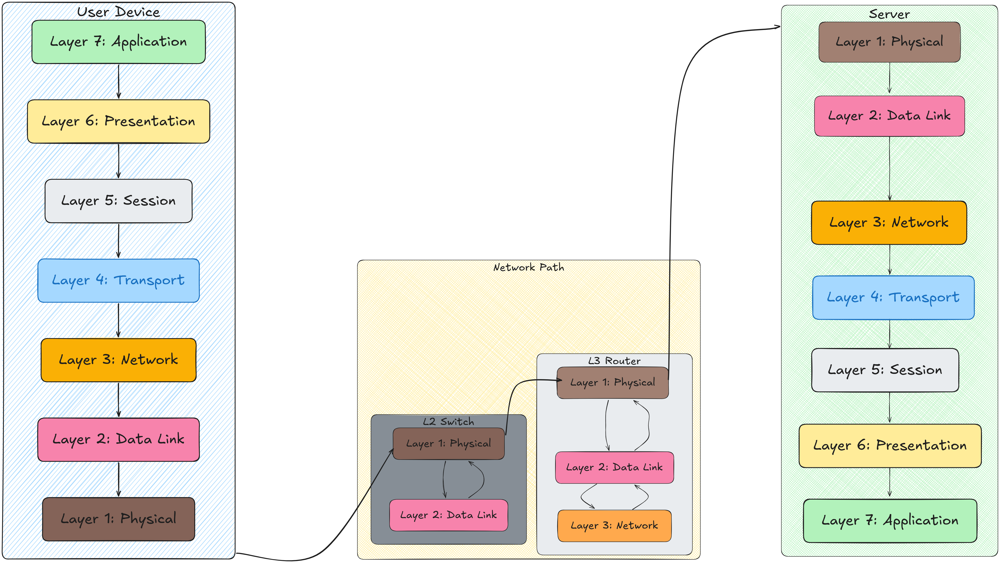
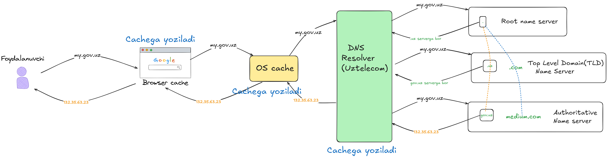
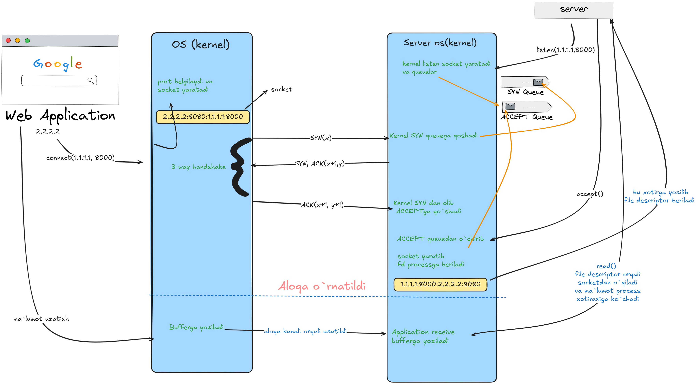

# Tarmoq (Networking) — Node.js

> Node.js bilan TCP, UDP va Unix socket'lari orqali tarmoq dasturlash: sodda serverlar, chat ilova va fayl yuklash misollari.







## 📁 Fayl tuzilmasi

```
network/
├── simple-tcp/
│   ├── simple-tcp-server.js    — Oddiy TCP server (port 3000)
│   └── simple-tcp-client.js    — TCP klient (ulanadi va salom yuboradi)
├── simple-udp/
│   ├── reciever.js             — UDP qabul qiluvchi (port 8000)
│   └── sender.js               — UDP jo'natuvchi (127.0.0.1:8000)
├── chat-app/
│   ├── server.js               — TCP server (barcha ulanishlarni boshqaradi)
│   └── client.js               — Interaktiv TCP klient (readline bilan)
└── uploader/
    ├── server.js               — Fayl qabul qiluvchi server (progress bilan)
    ├── client.js               — Fayl yuboruvchi klient
    └── info.txt                — Ishlatiladigan modullar: net, fs, stream, buffer
```

---

## 🚀 Ishga tushirish

### TCP Server va Klient

```bash
# Terminal 1 — Server
cd simple-tcp
node simple-tcp-server.js
# Port 3000 da tinglaydi

# Terminal 2 — Klient
node simple-tcp-client.js
# Serverga ulanadi va "Hello" yuboradi
```

### UDP Jo'natish va Qabul qilish

```bash
# Terminal 1 — Qabul qiluvchi
cd simple-udp
node reciever.js
# Port 8000 da UDP paketlarni kutadi

# Terminal 2 — Jo'natuvchi
node sender.js
# 127.0.0.1:8000 ga UDP paket yuboradi
```

### Chat Ilovasi (TCP asosida)

```bash
# Terminal 1 — Server
cd chat-app
node server.js

# Terminal 2, 3... — Klientlar (bir nechta bo'lishi mumkin)
node client.js
# Terminalga xabar yozing — boshqa klientlarga yuboriladi
```

### Fayl Yuklash

```bash
# Terminal 1 — Server
cd uploader
node server.js

# Terminal 2 — Klient
node client.js
# Faylni stream orqali serverga yuboradi, progress ko'rsatadi
```

---

## 🔍 TCP vs UDP

| Xususiyat | TCP                         | UDP                    |
| --------- | --------------------------- | ---------------------- |
| Ulanish   | ✅ (3-way handshake)        | ❌ (connectionless)    |
| Kafolat   | ✅ (barcha paketlar yetadi) | ❌ (yo'qolishi mumkin) |
| Tartib    | ✅                          | ❌                     |
| Tezlik    | O'rtacha                    | Tez                    |
| Ishlatish | HTTP, fayl yuklash          | Video stream, o'yinlar |

---

## 📚 Bog'liq maqolalar

- [TCP va UDP](https://habibovulugbek.medium.com/tcp-va-udp-8ee56341c713)
- [TCP handshake](https://habibovulugbek.medium.com/tcp-handshake-dee5418cef95)
- [TCP slow start](https://habibovulugbek.medium.com/tcp-slow-start-6e6e88d3899b)
- [HTTP (HTTP versiyalari)](https://habibovulugbek.medium.com/http-http-versiyalari-afb9fe438585)
- [DNS qanday ishlaydi?](https://medium.com/@habibovulugbek/dns-qanday-ishlaydi-83dca63ba8c6)
- [Network yoki OSI model qismlari](https://habibovulugbek.medium.com/network-yoki-osi-model-qismlari-ced6473418f9)
- [Internet qanday ishlaydi?](https://habibovulugbek.medium.com/internet-qanday-ishlaydi-yoki-malumot-almashish-qanchalik-o-zgardi-ae79e5dddc13)
- [Stream orqali chat app quramiz](https://habibovulugbek.medium.com/stream-orqali-chat-app-quramiz-2766cd7a1135)

Rasmiy hujjatlar: [Node.js Net API](https://nodejs.org/api/net.html)
